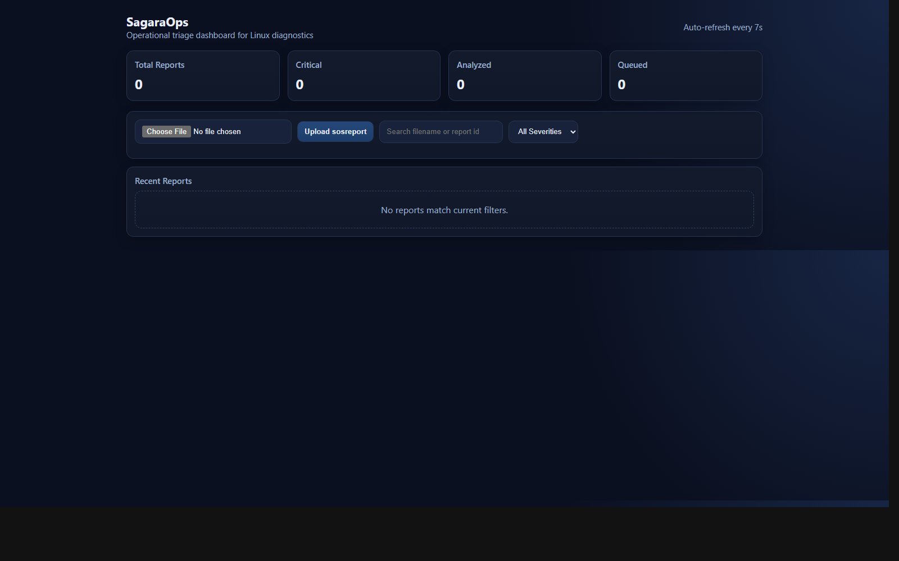
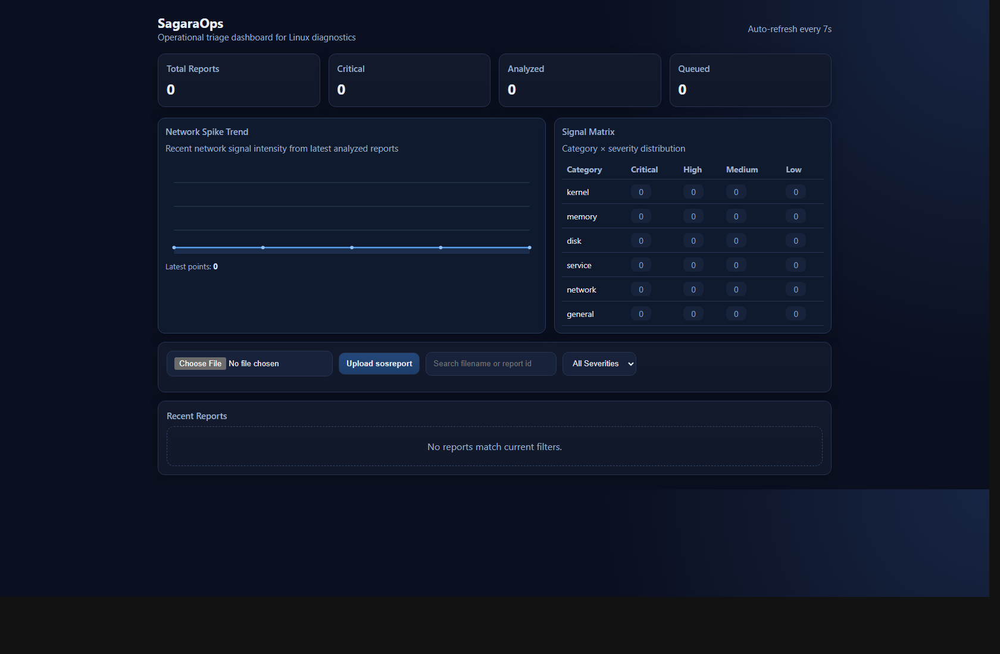
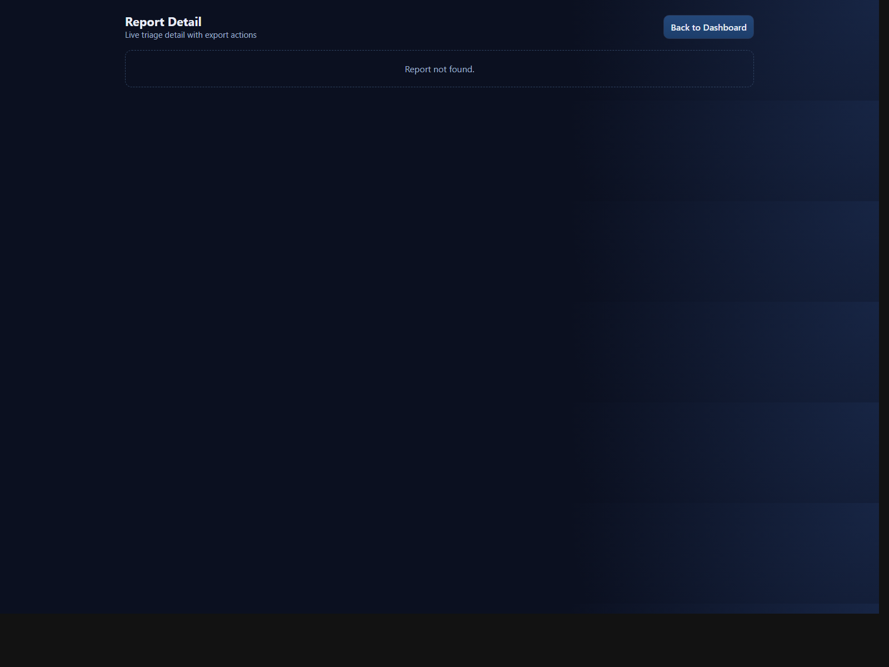

# SagaraOps — Quick Manual Book

This guide covers basic usage of the SagaraOps web UI.

## 1) Dashboard Overview

Main sections:
- **KPI cards**: Total reports, Critical, Analyzed, Queued
- **Upload bar**: upload a `sosreport`/log file for analysis
- **Search/Filter**: find reports by filename/id and severity
- **Recent Reports table**: monitor status + open report detail

---

## 1.1) Operational Graphics (Modern)

Added modern visual analytics:
- **Network Spike Trend** (sparkline): quick anomaly scanning over recent reports
- **Signal Matrix** (heat-style): category × severity distribution at a glance

---

## 2) Upload and Analyze

1. Open dashboard (`/`)
2. Select report file
3. Click **Upload sosreport**
4. Wait until status changes from `queued` to `analyzed`

Auto refresh runs every ~7 seconds.

---

## 3) Report Detail and Exports

In **Report Detail** (`/reports/{id}`):
- View status + severity badges
- Read AI Summary
- Review structured findings (category, signal, evidence)
- Export using action buttons:
  - **Export JSON**
  - **View Markdown**
  - **Export PDF**
  - **Export Bundle (ZIP)**

---

## 4) API Export Endpoints

- `GET /v1/reports/{id}/export.json?download=1`
- `GET /v1/reports/{id}/export.md`
- `GET /v1/reports/{id}/export.pdf`
- `GET /v1/reports/{id}/export.bundle`

---

## 5) Notes

- Severity and findings are generated by parser + worker pipeline.
- If AI runtime is unavailable, system uses deterministic fallback summary.
- For production use, apply branch protection and access control policy.
